# TradeFlow at Scale

> A bounded-memory market-microstructure study of 41,962,464 BTCUSDT aggregate
> trades, ending in a locked holdout test and a three-page Power BI report.

I built this project to close a specific experience gap: my earlier coursework
used relatively small, clean datasets, while analytics roles often require
working with millions of imperfect records under real memory and validation
constraints. The result is not a profitable-strategy showcase. It is an
end-to-end demonstration of data engineering, SQL, statistical discipline, and
honest communication when a hypothesis fails.

## Project at a glance

| Data engineering | Analytical output | Locked holdout |
| --- | --- | --- |
| 41,962,464 aggregate trades | 44,640 one-minute bars | 2,880 eligible bar pairs |
| 52,549,865 underlying fills | 8,928 five-minute bars | 429 signal trades |
| 3.501 GB expanded CSV | 31 daily Parquet partitions | −1.166 bps predictive lift |
| 1 GB DuckDB memory limit | 18.1× median query speed-up | **NOT_SUPPORTED** |

**Stack:** Python, SQL, DuckDB, PyArrow, Parquet, pandas, statsmodels,
Matplotlib, Git, and Power BI Service.

## Research question

> Does unusually strong buyer-initiated trading in a completed five-minute
> BTCUSDT interval help predict the following five-minute return after trading
> costs?

I used Binance BTCUSDT spot aggregate trades for 1–31 January 2024. An
aggregate-trade row represents one or more fills belonging to the same
market-taking order at the same price and time. It provides trade-level order
flow, but it is not an order-book snapshot.

The feature was quote-notional order-flow imbalance (OFI):

```text
(buyer-initiated USDT notional − seller-initiated USDT notional)
────────────────────────────────────────────────────────────────
                    total USDT notional
```

OFI ranges from −1 to +1. Positive values indicate more aggressive buying;
negative values indicate more aggressive selling.

## Final result

The rule was developed on 1–21 January and frozen before inspecting the
22–31 January holdout. A supportive result required all three of the following:

1. positive predictive lift;
2. a Newey–West HAC 95% interval entirely above zero; and
3. positive cumulative net return under the primary 5 bps-per-side cost case.

| Holdout metric | Result |
| --- | ---: |
| Eligible signal/target pairs | 2,880 |
| Signal trades | 429 |
| Signal exposure | 14.896% |
| Signal win rate | 44.289% |
| Mean next-bar return after a signal | −0.901 bps |
| Mean next-bar return without a signal | +0.265 bps |
| Predictive lift | −1.166 bps |
| Newey–West HAC 95% interval | [−2.424, 0.092] bps |
| Cumulative gross return | −3.827% |
| Cumulative return at 5 bps per side | −37.376% |
| Cumulative return at 10 bps per side | −59.222% |
| Locked decision | **NOT_SUPPORTED** |

The point estimate was negative and its interval included zero, so the data did
not support positive predictive lift. Costs made the economic outcome worse.
I kept the predeclared rule and reported the failure instead of tuning a new
threshold after seeing the holdout.

## How I built it — start to finish

### 1. Defined the question and guardrails

I began with one narrow hypothesis, one market, and one month. I predeclared a
long-or-cash rule with no short selling or leverage, separated development from
holdout data, and set an internal DuckDB memory limit of 1 GB. This kept the
project answerable on a personal laptop and limited researcher discretion.

### 2. Investigated one sample day

Before scaling up, I downloaded one daily ZIP and its publisher-provided
SHA-256 file. I verified the checksum, examined the eight raw fields, converted
millisecond timestamps to UTC, and confirmed the meaning of Binance's
`buyer_is_maker` flag: when it is false, the buyer was the aggressor.

This sample-first step caught schema and interpretation risks before they could
be multiplied across the full month.

### 3. Designed the typed storage layer

I retained immutable daily ZIPs as the raw layer and converted each day into a
date-partitioned Parquet file. Prices and quantities were parsed as exact
base-10 decimals, quote notional was derived explicitly, and each file used
ZSTD compression with 250,000-row groups.

Each conversion wrote to an `.in_progress` file and renamed it only after all
checks passed. This atomic-write pattern prevents an interruption from leaving
a partial file that looks complete.

### 4. Benchmarked CSV against Parquet

I ran the same projected, filtered analytical query five times on the sample
day in both formats.

| Format | Median query time |
| --- | ---: |
| CSV | 0.1013 seconds |
| Parquet | 0.0056 seconds |
| Measured speed-up | **18.1×** |

The comparison demonstrated why column-oriented storage, projection, and
filter pushdown matter for repeated analytical scans.

### 5. Scaled ingestion to the full month

The pipeline processed one UTC day at a time rather than loading the month into
pandas. For every partition it recorded the checksum, row count, first and last
aggregate-trade IDs, timestamp range, underlying-fill count, file sizes,
timings, status, and peak process memory.

The final audit reconciled 31 partitions, 41,962,464 aggregate trades, and
52,549,865 underlying fills with continuous IDs and timestamps. Re-running the
pipeline skips an existing partition only after validating it, making the
process restartable and idempotent.

### 6. Built analytical time bars with DuckDB SQL

DuckDB scanned the partitioned Parquet files directly and aggregated the trades
into 44,640 one-minute bars. Those bars were then rolled into 8,928 five-minute
bars containing OHLC prices, VWAP, base and quote volume, aggressive buy and
sell notional, OFI, and source-row controls.

The full trade table was never loaded into pandas or Power BI. DuckDB was
configured to spill temporary work to disk when required. Its 1 GB setting is
an internal database limit; Python, Arrow, and operating-system overhead were
measured separately through process RSS.

### 7. Defined the signal without using future returns

On the development period only, I selected the 90th percentile of OFI as the
buyer-heavy cutoff. This produced a frozen threshold of `0.2652129210`; it was
chosen from the feature distribution rather than optimised against returns.

The signal becomes available only after five-minute bar `t` closes. A signal
enters at the open of bar `t+1` and exits at that bar's close. SQL `LEAD`
operations create this signal/target pairing while preserving the time order.

### 8. Locked the specification before revealing the holdout

I saved the data fingerprint, feature definition, threshold, execution timing,
cost formula, inference method, and success criteria in a specification file.
Its SHA-256 fingerprint was stored separately. A preflight step validated the
lock, input file, and SQL without calculating any holdout performance.

This separated model development from evaluation and prevented silent changes
after the result was known.

### 9. Evaluated prediction, uncertainty, and costs

The holdout evaluator applied the frozen rule once. Predictive lift was defined
as the mean next-bar return on signal bars minus the mean on non-signal bars.
I estimated uncertainty with an OLS binary-signal coefficient and Newey–West
heteroskedasticity-and-autocorrelation-consistent standard errors using 12
five-minute lags, equivalent to one hour.

I compounded returns under 0, 5, and 10 bps of adverse execution cost per side.
The evaluator fingerprinted every final output and refuses to silently replace
an existing evaluation record.

### 10. Built a reconciled Power BI reporting layer

I did not send 42 million rows to Power BI. Instead, I exported eight small,
purpose-built tables:

| Table role | Grain and purpose |
| --- | --- |
| Sample dimension | Development and holdout labels |
| Cost dimension | 0, 5, and 10 bps-per-side cases |
| Bar fact | 8,927 signal bars paired with their following execution bars |
| Equity fact | 26,781 sample-cost-time observations |
| Cost scenarios | Six sample-by-cost summaries |
| Diagnostics | Predictive statistics for the two samples |
| Daily ingestion | 31 partition audit records |
| Engineering summary | Whole-project scale and performance controls |

The browser-based Power BI report contains three pages:

- **Research Outcome:** locked holdout metrics, equity curve, and cost
  sensitivity;
- **Signal Behaviour:** threshold, exposure, win rate, signal-group returns,
  and OFI versus the next-bar return; and
- **Engineering Scale & Data Quality:** pipeline scale, daily volumes, file
  sizes, and the ingestion audit.

I created one-to-many, single-direction relationships from the sample and cost
dimensions, added DAX measures, checked visual interactions, and reconciled the
dashboard values to the immutable research outputs.

### 11. Added final verification and presentation checks

The local project has an automated verification command that rechecks the
month-level row totals, bar counts, benchmark, locked-specification fingerprint,
holdout-output fingerprints, Power BI reporting tables, and presentation
assets. The final run completed with every control passing.

## Architecture

```mermaid
flowchart LR
    A[Binance daily ZIP<br/>and SHA-256] --> B[Checksum and schema validation]
    B --> C[Typed daily Parquet<br/>ZSTD, 250k-row groups]
    C --> D[DuckDB SQL<br/>bounded memory and disk spill]
    D --> E[1-minute bars]
    E --> F[5-minute bars and OFI]
    F --> G[Development period<br/>choose and freeze rule]
    G --> H[Untouched holdout<br/>HAC and cost tests]
    H --> I[Reconciled reporting tables]
    I --> J[Power BI<br/>three-page report]
```



## Key controls and why they matter

| Risk | Control |
| --- | --- |
| Corrupt download | Publisher SHA-256 checked before conversion |
| Wrong schema | Explicit column names and data types |
| Floating-point money errors | Exact decimal price, quantity, and notional fields |
| Partial output | Atomic `.in_progress` write followed by rename |
| Duplicate work after interruption | Validate-and-skip idempotent daily partitions |
| Missing or repeated records | Daily and monthly ID, timestamp, row, and fill controls |
| Laptop memory pressure | Daily batches, Parquet, DuckDB memory limit, and disk spill |
| Slow repeated scans | Columnar storage, row groups, projection, and filter pushdown |
| Look-ahead bias | Completed bar `t` predicts only bar `t+1` |
| Post-result rule changes | Fingerprinted specification locked before holdout |
| Serial correlation | Newey–West HAC standard errors |
| Unrealistic frictionless result | 0, 5, and 10 bps-per-side sensitivity cases |
| Dashboard double-counting | Explicit table grains and one-to-many relationships |

## What I learned

- Large-data work is mainly about controlling movement, memory, and failure
  states—not merely choosing a faster dataframe library.
- A fast pipeline is not enough; every transformation needs reconciliation
  controls that prove the output still represents the source.
- In market research, timing discipline and an untouched holdout matter as much
  as the indicator itself.
- Transaction costs can dominate a short-horizon strategy even before market
  impact and latency are modelled fully.
- A negative result can be portfolio-worthy when the test is well designed,
  reproducible, and communicated without hindsight tuning.

## Limitations and next steps

- One month of one crypto pair cannot establish a durable market effect.
- Aggregate trades do not reconstruct the bid/ask order book.
- Aggressor side is inferred from Binance's maker-side flag.
- Entry at the next bar's exact open is idealised; latency and market impact are
  not modelled directly.
- Cost cases are sensitivity assumptions, not a claim about a specific
  exchange account's fees or realised slippage.
- The natural extension is a preregistered multi-month walk-forward study with
  bid/ask-aware execution, stability checks across market regimes, and no reuse
  of this holdout for model selection.

## Data source and public-repository scope

- **Market:** Binance BTCUSDT spot aggregate trades (`aggTrades`)
- **Period:** 1–31 January 2024 UTC
- **Source:** [Binance public market-data archive](https://data.binance.vision/?prefix=data/spot/daily/aggTrades/BTCUSDT/)

This public repository is intentionally a self-contained project case study and
contains only this README. The complete working directory—including source
code, guided notebooks, immutable result records, reporting tables, and
dashboard exports—is preserved locally for demonstration. Raw downloaded and
generated market data are not redistributed.

This is an educational data-engineering and research project, not financial
advice or a live trading system.
